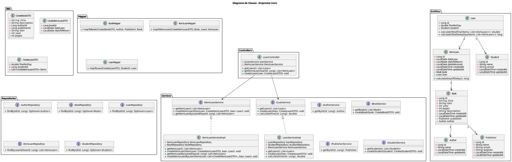
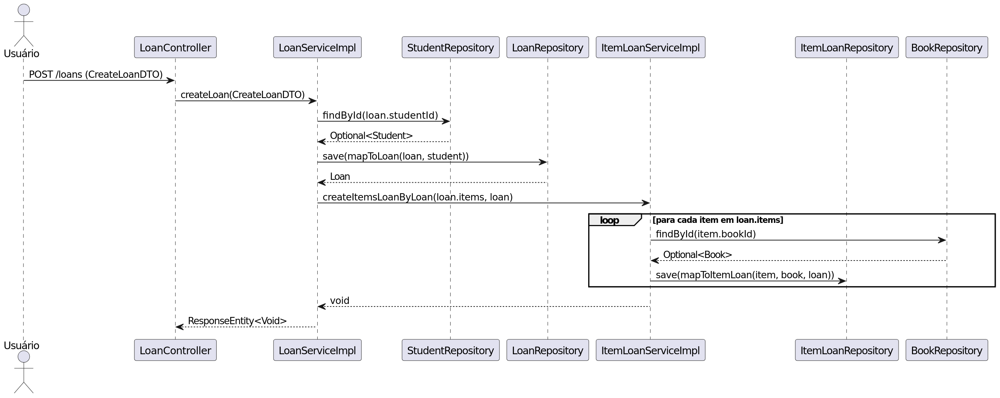
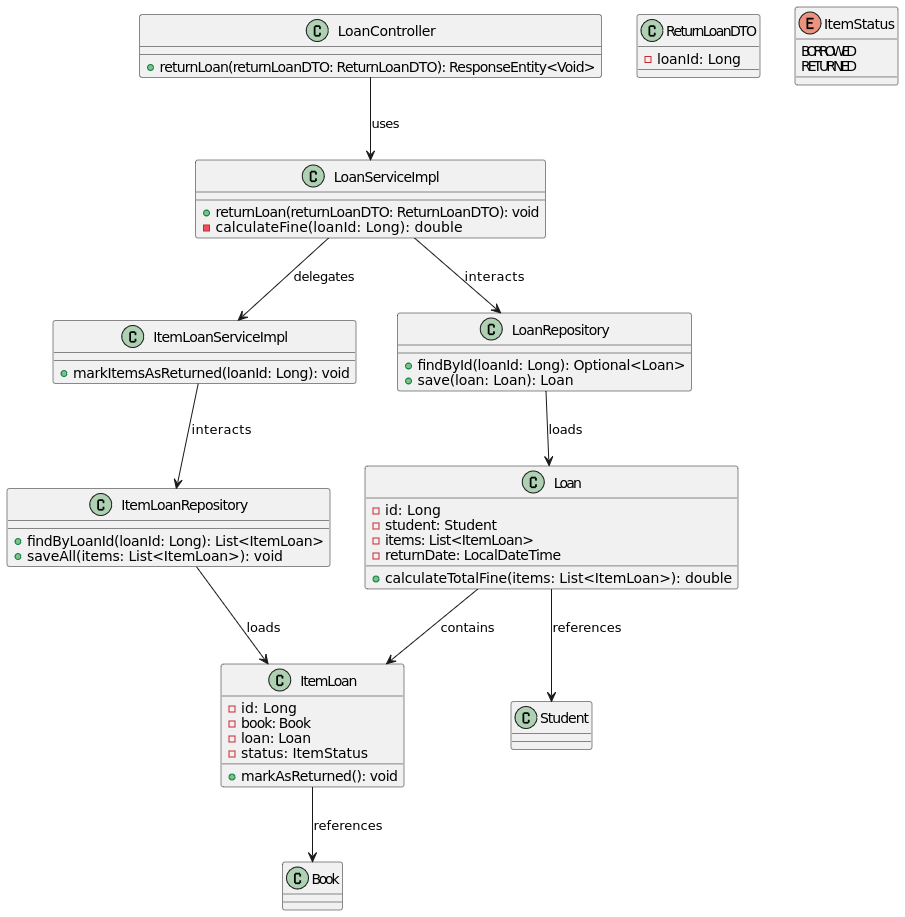
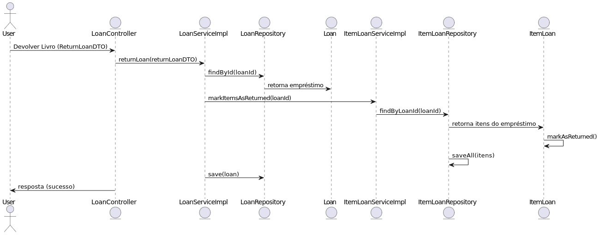

# Trabalho Final de Engenharia de Software II

## Ferramentas e Tecnologias

O projeto foi desenvolvido utilizando **Java** como linguagem de programação principal, juntamente com o **Spring Framework**, que facilita a criação de APIs robustas e escaláveis. 

O uso do Spring permite simplificar o código, uma vez que o framework fornece implementações prontas para diversas operações. Por exemplo, a definição de interfaces, métodos genéricos e a comunicação com o banco de dados são tratadas automaticamente por módulos como **Spring Data JPA**, eliminando a necessidade de código manual.

Para a interface gráfica, foram utilizados **TypeScript** — uma variação tipada do JavaScript — e as bibliotecas **React** e **TailwindCSS**. O React facilita a criação de componentes reutilizáveis e interativos, enquanto o TailwindCSS permite estilizar as interfaces de maneira eficiente e modular.

---

## Visão Conceitual

O desenvolvimento do sistema segue princípios de **padrões arquiteturais** e **padrões de projeto** bem definidos, como **Arquitetura em Camadas**, **MVC** (Model-View-Controller) e **DAO** (Data Access Object).

### Estrutura de Camadas e Padrão MVC

A arquitetura em camadas é claramente visível na organização do projeto, composta por três camadas principais:

1. **Controller**:  
   É responsável pelo controle do fluxo das chamadas realizadas pelos usuários por meio da interface. A camada de Controller recebe as requisições HTTP e encaminha as chamadas para os serviços correspondentes.

2. **Service**:  
   Nessa camada são implementadas as regras de negócio e as validações necessárias. Além disso, é onde ocorre o mapeamento entre **DTOs** (Data Transfer Objects) e **Modelos**. Dessa forma, a camada Service garante que as funcionalidades específicas do sistema sejam executadas de forma organizada e independente.

3. **Repository**:  
   Aqui é realizada a comunicação com o banco de dados. As interfaces são definidas e os métodos necessários para manipulação dos dados são gerados automaticamente pelo **Spring Data JPA**, evitando a implementação manual. O padrão **DAO** está presente, porém de forma implícita, abstraída pelo próprio framework.

### Vantagens da Arquitetura Utilizada

A escolha dessa abordagem traz diversos benefícios, como:

- **Alta modularidade**: Cada camada possui uma responsabilidade específica, facilitando o desenvolvimento e a manutenção.
- **Baixo acoplamento**: As camadas são independentes, o que permite alterações em uma camada sem afetar as demais.
- **Alta coesão**: Cada classe e método tem um propósito bem definido.
- **Escalabilidade**: A arquitetura facilita a expansão do sistema conforme novas funcionalidades são adicionadas.
- **Conformidade com boas práticas**: Seguir padrões como MVC e DAO é uma convenção amplamente utilizada em sistemas semelhantes, tornando o projeto mais compreensível e adaptável.

---

## Diagramas

A seguir, apresentamos os diagramas de **classes** e **sequência** que representam as funcionalidades de **empréstimo** e **devolução de livros**.

### Caso: Empréstimo de Livro

O fluxo de empréstimo segue os seguintes passos:

1. O método é chamado na camada **Controller**.
2. A **interface** do serviço correspondente é acionada.
3. A implementação do serviço realiza a lógica necessária e chama a camada **Repository**.
4. O repositório, por sua vez, interage com o banco de dados.

#### Diagramas:

- **Diagrama de Classes**  

- **Diagrama de Sequência**  

---

### Caso: Devolução de Livro

O fluxo de devolução segue uma lógica semelhante ao empréstimo:

1. A requisição é recebida na camada **Controller**.
2. A interface do serviço é chamada, encaminhando para sua implementação.
3. A implementação do serviço aciona o **Repository**, que realiza a operação no banco de dados.

#### Diagramas:

- **Diagrama de Classes**  

- **Diagrama de Sequência**  

---

## Discussão

O uso da **Arquitetura em Camadas**, aliado ao **Spring Framework**, **React** e **TailwindCSS**, resultou em um sistema bem estruturado, organizado e de fácil manutenção. 

A separação das responsabilidades em **Controller**, **Service** e **Repository** promove um sistema escalável e adaptável. A implementação das regras de negócio na camada Service garante a centralização da lógica do sistema, facilitando testes e alterações futuras.

Além disso, a utilização de ferramentas modernas na interface gráfica, como React e TailwindCSS, possibilita uma experiência de usuário agradável, com componentes reutilizáveis e estilização eficiente.

Por fim, o uso de diagramas de **classes** e **sequência** ajudou a visualizar e documentar o fluxo das principais funcionalidades do sistema, como **empréstimo** e **devolução de livros**, contribuindo para um melhor entendimento do projeto.

---

